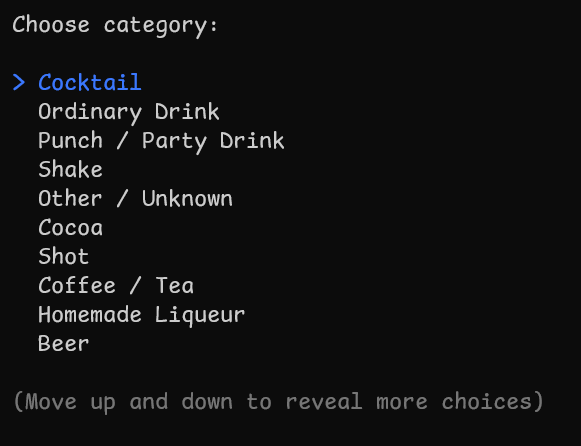
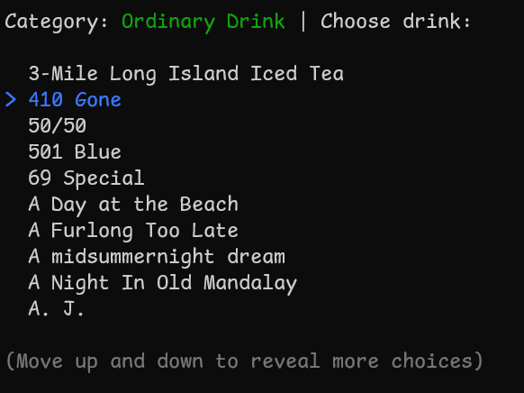
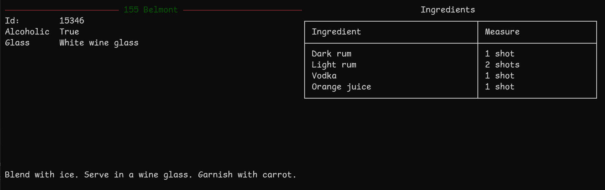
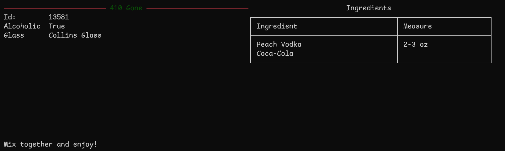
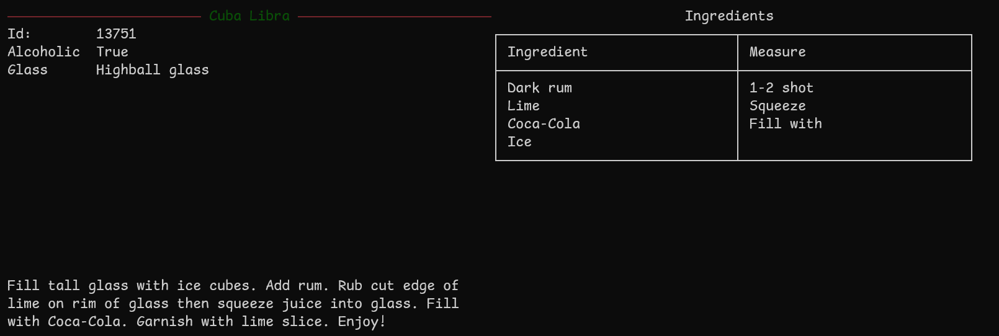
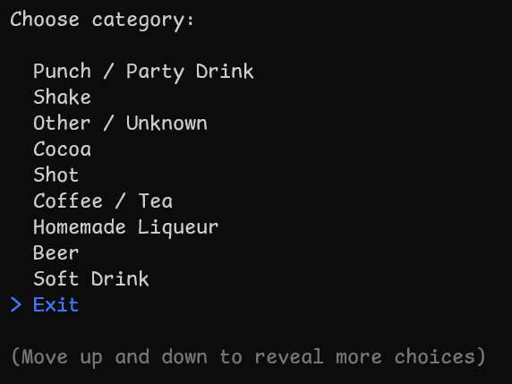

# TCSA.DrinksMenu

I've been hired by a fictitious restaurant to create a small app for them to look up drinks with.

# How to use

On opening the application the user will be presented with a list of categories of drinks to choose from:

Use the arrow keys to navigate up and down the list. Press Enter to select the category you would like to view drinks 
from.  
From the category menu, navigate through the list again and then choose the drink to view:

From any menu you will be given the option to go back (or exit):

# Requirements

- [X] Create a system the allows an employee to pull data from any available drink
- [X] Drinks are all provided by an external company
  - [X] All data about drinks will be provided via a REST API: [The Cocktail DB](https://www.thecocktaildb.com/api.php)
- [X] Users should be presented with a drinks category menu and invited to choose a category
- [X] They will then have the opportunity to choose a drink and see information about it
- [X] When shown a drink, there shouldn't be any properties with empty values

## Stretch Goals

This project is well defined, but without much room to maneuver.  
Any stretch goals I've thought up would unfortunately likely compromise the few requirements given.

# Features

This console application allows a user to select from different drinks categories, and then from a list of drinks within
the category. Once a drink has been accessed, this is then cached until the application exits.

# Challenges

No real challenges here to be honest.  
The only issue I ran into is that having come from primarily Dynamic languages in the past, the shape of the API was a 
touch annoying to work with (where in the dynamic languages you can just dig straight through properties you're not 
interested in).

# Lessons Learned

- Was good to see how C# handles HTTP requests.

# Areas to Improve

- Per the challenge above, perhaps Anonymous or Expando Objects may help with the digging...
- Error handling
  - The API used here doesn't really go into what errors it can generate and under what conditions So I didn't really
do any error handling
  - Propert handling of Auth errors, rate limiting, etc. would be good to look into
- Configuration, we're just using a test API key here. In the real world we'd want some sort of configuration to
allow the user to set this

# Resources Used

- Microsoft Documentation [HTTP Requests](https://learn.microsoft.com/en-us/dotnet/csharp/tutorials/console-webapiclient)
- [The Cocktail DB](https://www.thecocktaildb.com)
- [Spectre.Console](https://spectreconsole.net)
